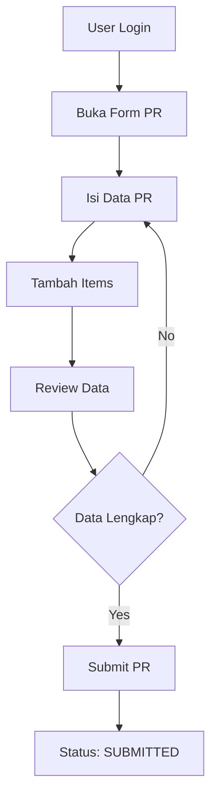
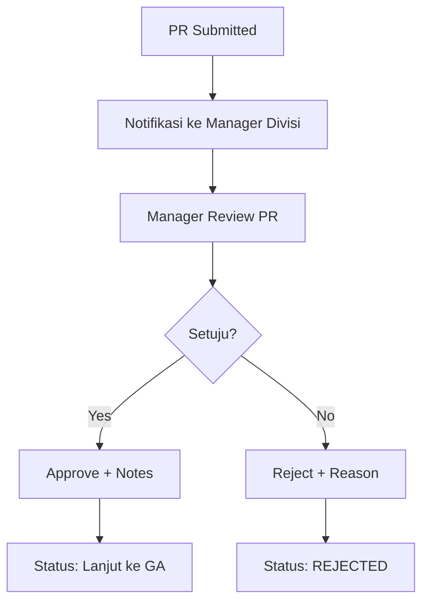
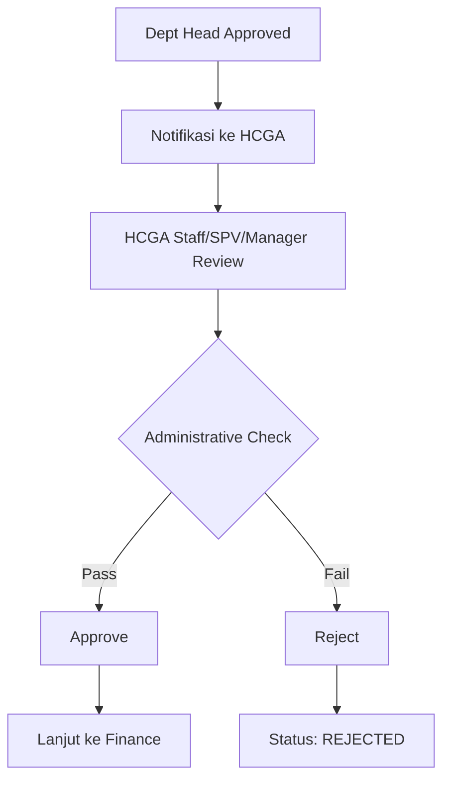
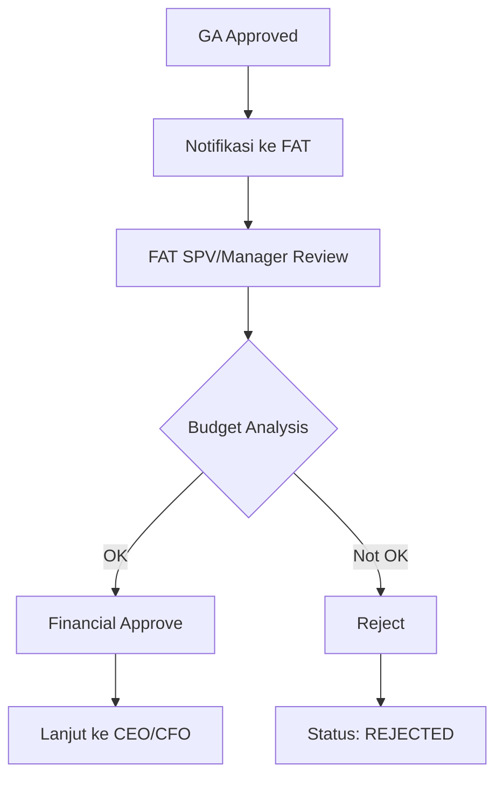
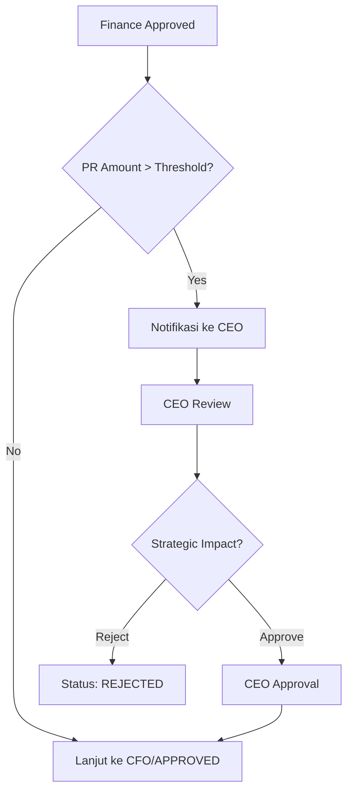
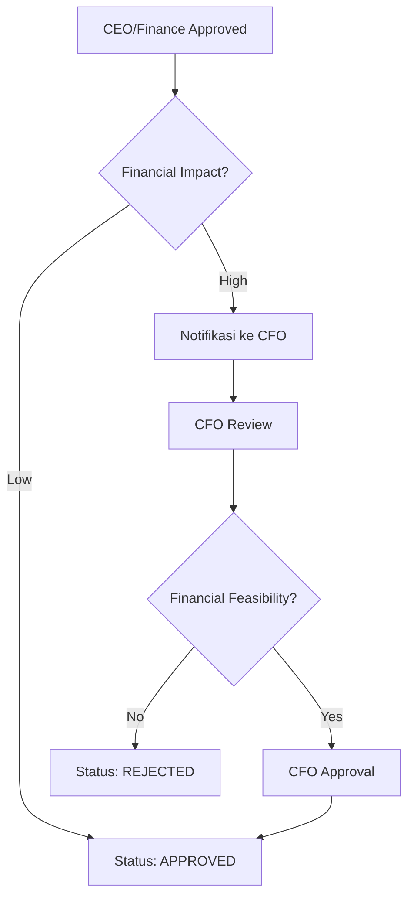
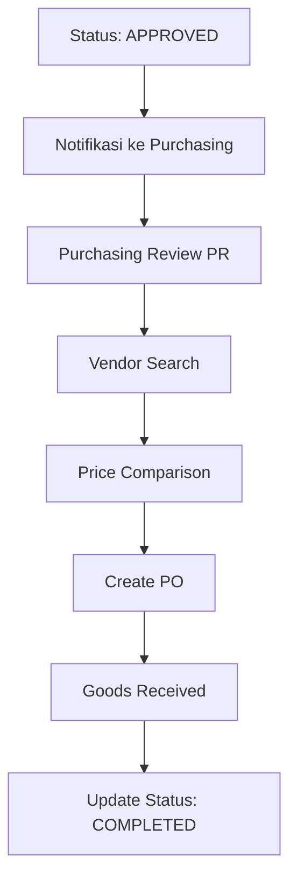
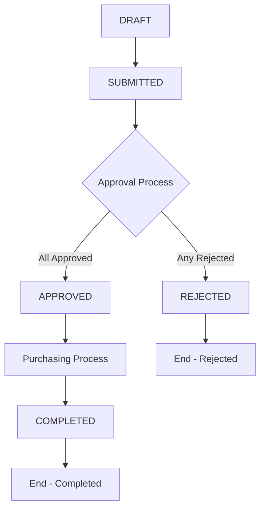

# 🔄 Purchase Request Workflow

## 📋 Alur Kerja Lengkap

### 1. 📝 Pembuatan PR (User)

**Langkah Detail:**
1. User login ke sistem
2. Navigasi ke menu "Purchase Request" → "Buat PR Baru"
3. Isi informasi dasar:
   - Request Date
   - Due Date  
   - Description
   - Location
4. Tambah items yang dibutuhkan:
   - Nama item
   - Quantity + Unit
   - Estimated Price
   - Description
5. Review dan submit PR

### 2. 🏢 Department Head Approval

**Kriteria Approval:**
- Manager dari divisi yang sama dengan pembuat PR
- Dapat memberikan notes/catatan
- Dapat melihat history PR dari divisinya

### 3. 🏛️ GA (General Affairs) Approval

**Tanggung Jawab GA:**
- Administrative compliance check
- Budget availability verification
- Policy compliance review

### 4. 💰 Finance Department Approval

**Financial Review:**
- Budget allocation check
- Cost-benefit analysis
- Financial policy compliance
- Vendor assessment (jika diperlukan)

### 5. 👑 Executive Approval (CEO/CFO)

#### CEO Approval Flow

#### CFO Approval Flow

### 6. 🛒 Purchasing Process

**Purchasing Workflow:**
1. **VENDOR_SEARCH** - Mencari vendor yang sesuai
2. **PRICE_COMPARISON** - Membandingkan harga dari beberapa vendor
3. **PO_CREATED** - Purchase Order telah dibuat
4. **GOODS_RECEIVED** - Barang telah diterima
5. **GOODS_RETURNED** - Barang dikembalikan (jika ada masalah)
6. **CLOSED** - Proses purchasing selesai → Status PR: COMPLETED

## 🔄 Status Transitions

### Status Flow Chart

### Detailed Status Rules

#### DRAFT
- PR baru dibuat
- Dapat diedit oleh pembuat
- Belum masuk approval flow

#### SUBMITTED  
- PR telah disubmit
- Tidak dapat diedit
- Masuk ke approval queue

#### APPROVED
- Semua level approval selesai
- Siap untuk purchasing process
- Notifikasi ke purchasing team

#### REJECTED
- Ditolak di salah satu level
- Proses approval berhenti
- Dapat dibuat PR baru jika diperlukan

#### COMPLETED
- Purchasing process selesai
- Barang telah diterima
- PR closed

## ⏰ Timeline & SLA

### Standard Processing Time
- **Department Head**: 1-2 hari kerja
- **GA Approval**: 1-3 hari kerja  
- **Finance Approval**: 2-5 hari kerja
- **CEO/CFO Approval**: 3-7 hari kerja
- **Purchasing Process**: 7-14 hari kerja

### Escalation Rules
- Auto-reminder setelah 50% SLA time
- Escalation ke level atas setelah 100% SLA time
- Emergency approval process untuk urgent items

## 🚨 Exception Handling

### Rejection Process
1. Approver memberikan reason untuk rejection
2. Sistem mengirim notifikasi ke pembuat PR
3. Status PR berubah ke REJECTED
4. Pembuat dapat membuat PR baru dengan perbaikan

### Emergency Approval
- Bypass untuk urgent/critical items
- Requires special authorization
- Audit trail untuk compliance

### System Issues
- Backup approval via email
- Manual override untuk admin
- Recovery procedures

---

**Next:** [User Guide](user-guide.md)
